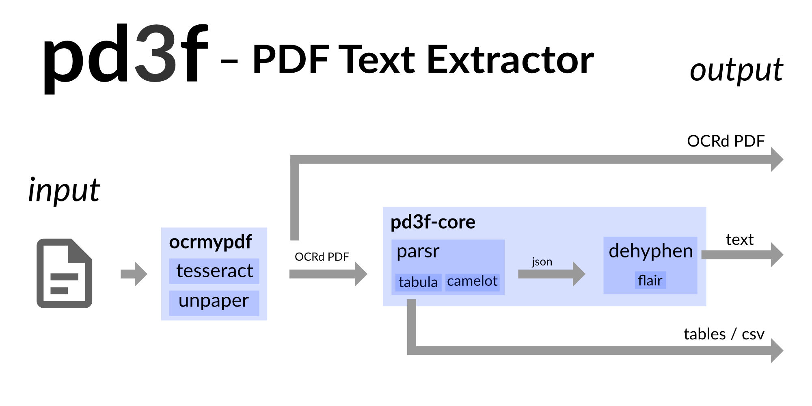

# `pd3f` – Beyond PDF

*Experimental, use with care.*

`pd3f` is a self-hosted Docker-based PDF **text extraction** pipeline for German, English and other languages.
It tries to **reconstruct** the **original text** with the help of machine learning.

`pd3f` can OCR scanned PDFs with [ocrmypdf](https://github.com/jbarlow83/OCRmyPDF) (tesseract) and extracts tables with [camelot](https://github.com/camelot-dev/camelot) and [tabula](https://github.com/tabulapdf/tabula).
It's build upon [parsr](https://github.com/axa-group/Parsr) to split the text on pages into words / lines / paragraphs.

The underlying Python package [pdddf](https://github.com/jfilter/pdddf) tries to reconstruct the original text of PDFs by removing hyphens, new lines and/or space. It uses [languages models](https://machinelearningmastery.com/statistical-language-modeling-and-neural-language-models/) to guess how the original text looked like.

`pd3f` includes a Web-based GUI and a [Flask](https://flask.palletsprojects.com/)-based micro service (API).

You can find a demo at [demo.pd3f.com](https://demo.pd3f.com).


## Installation

You need to setup [Docker](https://docs.docker.com/get-docker/).

You need the `docker-compose.yml` file of this repository. You can download it separately or just fetch the whole repository.

```
git clone https://github.com/pd3f/pd3f
```

You need to have ~4 GB of space to store all the software / data to run this.


## Usage: GUI

You need the `docker-compose.yml` and then run

```bash
docker-compose up
```

This will download the Docker images and will take a while. After it's finished access the Web-based GUI at <http://localhost:1616>.

After uploading a PDF you will get redirected to a web page displaying progress / results of the job.

## Usage: API

```python
import time

import requests

files = {'pdf': ('test.pdf', open('/dir/test.pdf', 'rb'))}
response = requests.post('http://localhost:1616', files=files, data={'lang': 'de'})
id = response.json()['id']

while True:
    r = requests.get(f"http://localhost:1616/update/{id}")
    j = r.json()
    if 'text' in j:
        break
    print('waiting...')
    time.sleep(1)
print(j['text'])
```

Post params:
 - `lang`: set the language
 - `fast`: whether to check for tables (default: False)
 - `tables`: whether to check for tables (default: False)
 - `experimental`: whether to extract text in experimental mode (default: False)
 - `check_ocr`: whether to check first if all pages were OCRd (default: True)

You have to poll for `/update/<uuid>` to keep progress. The responding JSON tells you about the status of the request.

Fields:
 - `log`: always present, text output from the job.
 - `text` and `tables` and `filename`: only present when the job finished successfully
 - `position`: present if on waiting list, returns position as integer
 - `running`: present if job is running
 - `failed`: present if job has failed

### Scaling

You can also run more worker with this:


```bash
docker-compose up --scale worker=3
```

To increase the frontend threads, change this line in `docker-compose.yml`:

```yml
command: gunicorn app:app --workers=5 --bind=0.0.0.0:5000
```

### House Keeping

You will see three folders:

- `pd3f-data-uploads`: input & output files
- `pd3f-data-cache`: storing data so you don't have to download model files over and over again
- `pd3f-data-to-ocr`: temporary location for PDFs to get OCRd. Files get deleted but logs get kept.

Results are kept for 24 hours per default. But no files get deleted automatically (only the results in the queue (e.g. the extracted text)).

Run this command from time to time to schedule jobs in order to delete files in `pd3f-data-uploads` and `pd3f-data-to-ocr`.

```bash
docker-compose run --rm worker rqscheduler --host redis --burst
```

## FAQ

### Parsr can also do OCR, why do use OCRmyPDF?

OCRmyPDF uses various image preprocessing to improve the image quality.
This improves the output of Tesseract.
Parsr uses raw Tesseract so the results are worse.

### Parsr can also extract text, why is your tool needed?

The text output of Parsr is scrambled, i.e. hyphens are not removed.
`pd3f` improves the overall text quality by reconstructing the original text with language models.
See [pdddf](https://github.com/pd3f/pdddf) for details.

Overall Parsr is a great tool, but it still has rough edges.
`pd3f` improves the output with various (opinionated) hand-crafted rules.
`pd3f` mainly focuses on formal letters and official documents for now.
Based on this assumption we can simplify certain things.
It was developed mainly for German documents but it should work for other languages as well.

## Future Work / TODO

PDFs are hard to process and it's hard to extract information.
So the results of this tool may not satisfy you.
There will be more work to improve this software but alltogether, it's unlikely that it will run an all documents anytime.

Here some things that will get improved.

### statics about how long processing (per page) took in the past

- calculate runtime based on `job.started_at` and `job.ended_at`
- Get average runtime of jobs and store data in redis list

### more information about PDF

- NER
- entity linking
- extract keywords
- use [textacy](https://github.com/chartbeat-labs/textacy)

### add more language

- check if flair has model
- what to do if there is no fast model?


### client

- simple client based on request
- send whole folders

### Markdown / HTML export

- go beyond text

### Use pdf-scripts

- reduce size
- repair PDF
- detect if scanned


## Related Work

- [a list of PDF processing tools in my blog post](https://johannesfilter.com/python-and-pdf-a-review-of-existing-tools/)

## License

GPLv3